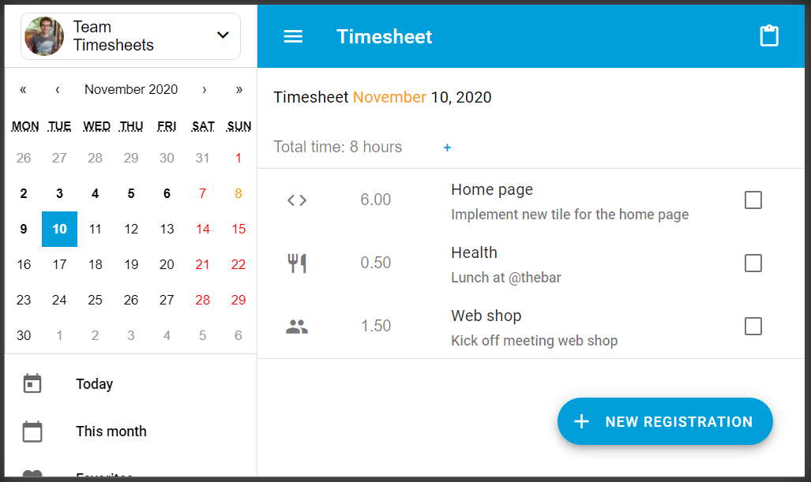
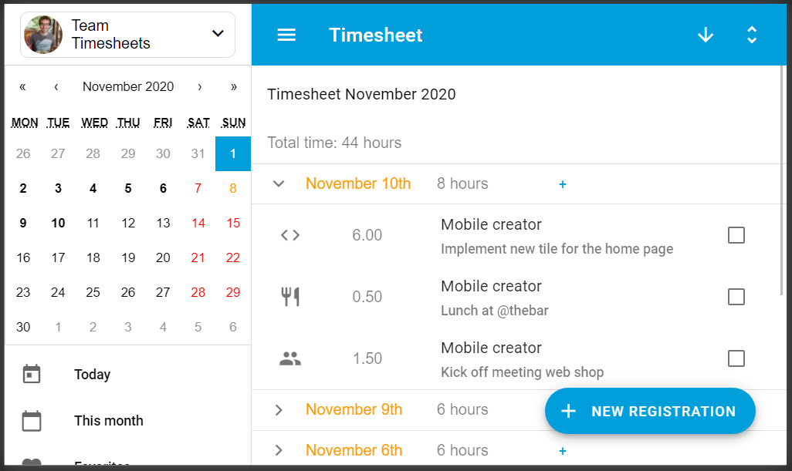
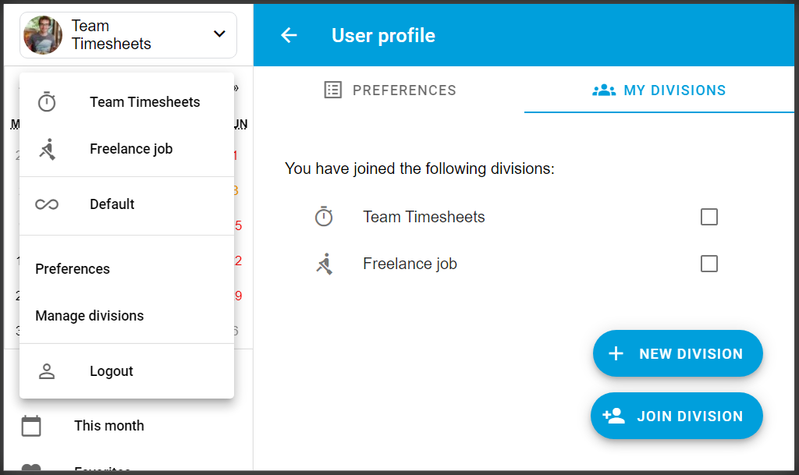
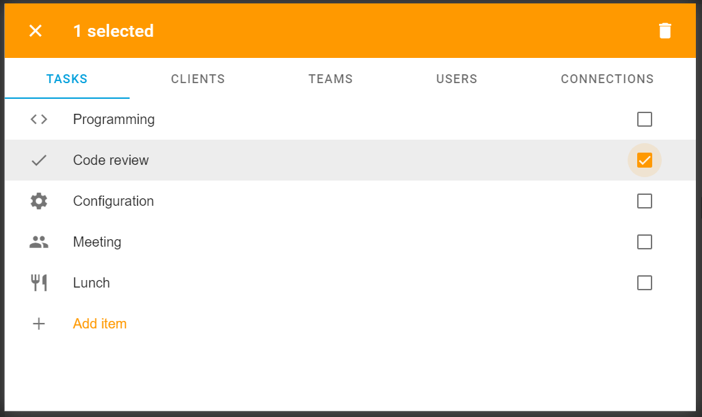

# Team Timesheets

Web base timesheet app. Built to replace old school excel timesheets.

:alarm_clock: [Team Timesheets web app](https://team-timesheets.web.app) :alarm_clock:

Try it out yourself :point_up:

Or just look at some screenshots :point_down:

**Day view**

**Month view**

**Divisions**

**Settings - tasks**

## Features

- **Divisions**  Manage your timesheets seperatly for multiple divisions.
- **Google calendar** Get suggestions for your timesheets from your google calendar events.
- **Copy & Paste** Simply copy repetitive tasks from one day into many other days.
- **Favorites** Quickly insert from your favorites / templates.
- **Export to csv** Get csv exports per month for your timesheets.
- **Bigquery** Can be set up to sync with bigquery for advanced reports.

## Contributing

Feel free to [contribute](./CONTRIBUTING.md)!

## Authors

* **Thomas Dekiere** - *Initial work* - [thdk](https://github.com/thdk)

## License

No license yet. See [no permission](https://choosealicense.com/no-permission/).

## Spam
This app is build using [Firestorable](https://github.com/thdk/firestorable). Have a look, it's great! (I made it :))